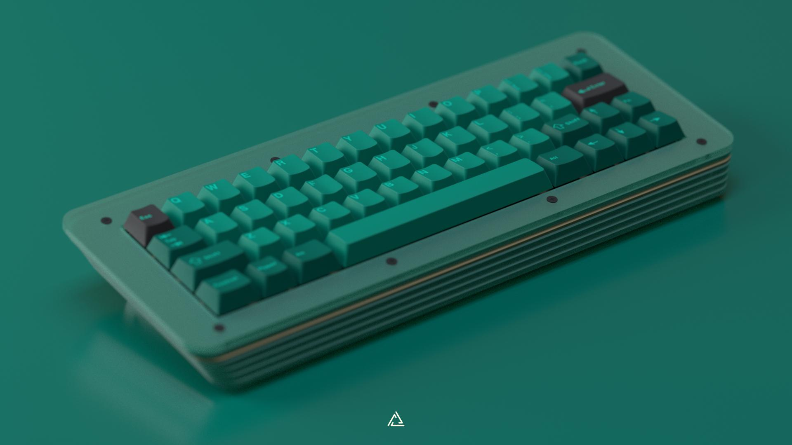
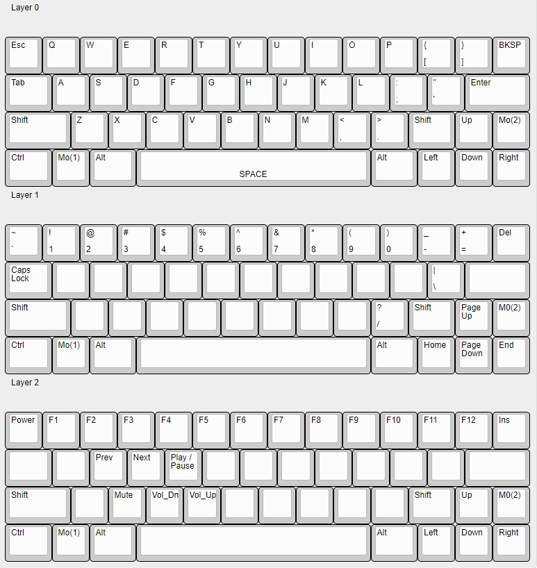

# Percebe

Percebe is a 48-key mechanical keyboard with a staggered layout, a 6.25U spacebar and arrow cluster. This keyboard has been designed for both new and experienced enthusiasts that have yet to try a small form factor keyboard.

## Proposed default layout

The proposed default layout was designed to be as intuitive as possible and requiring little adaptation time. When pressing the left function key, we put more emphasis on the right side, and when pressing the right function key, we do the opposite.

- Layer 0: allows a basic typing experience with an arrow cluster.
- Layer 1: by holding the left function key MO(1) we access the number row, pipe and question mark keys, and on the right side the navigation cluster and delete key.
- Layer 2: by holding the right function key MO(2) we access the function row and media keys, which are placed on the left side of the keyboard.

## Making the acrylic pieces

The case is made out of a bunch of 3mm thick layers of acrylic. Here are a handful of ways of getting these pieces done:

- Commissioning one to an acrylic keyboard maker.
- Contacting local maker spaces or a laser cutting shop.
- Ordering online:
    - [Ponoko (NA)](https://www.ponoko.com/)
    - [Formulor (EU)](https://www.formulor.de/)

## Making the switch plate

As for the leaf spring switch plate, take these into consideration:

- **DO NOT** make it out of acrylic.
- As this is a leaf spring plate, consider making it out of 1.5mm aluminium. I ordered mines on [Laser Boost](https://www.laserboost.com/).
- Alternatively, carbon fibre and FR4 could be used.

## The PCB

I've included in the assembly a placeholder of the wilba.tech WT45-A hot-swap PCB.

## Other components

- 6×  M2 square nuts.
- 8×  M2 18mm long spacers.
- 6×  M2 20mm long spacers.
- 28× M2 4mm long screws. Ultra-low profile socket head.
- 6×  M2 8mm long screws. Ultra-low profile socket head.

## Disclaimers

- Use your files at your own risk.
- Basic CAD and vector work (Inkscape/Affinity Designer) is required to prepare the assembly for production.
- The plate has been designed to be made out of metal.

## License

This repository is under the GNU GPL V3 license. Follow [this link](./license) to learn more.

**Permissions of this strong copyleft license are conditioned on making available complete source code of licensed works and modifications, which include larger works using a licensed work, under the same license. Copyright and license notices must be preserved. Contributors provide an express grant of patent rights.**
